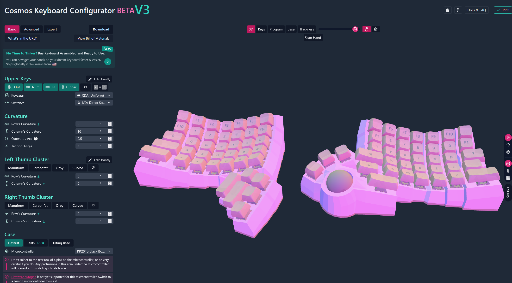
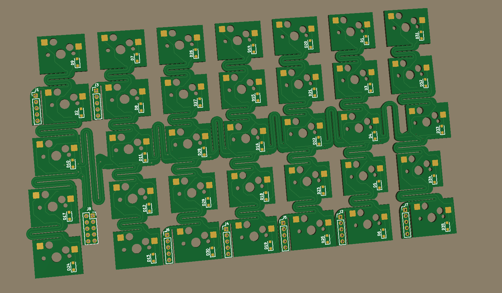
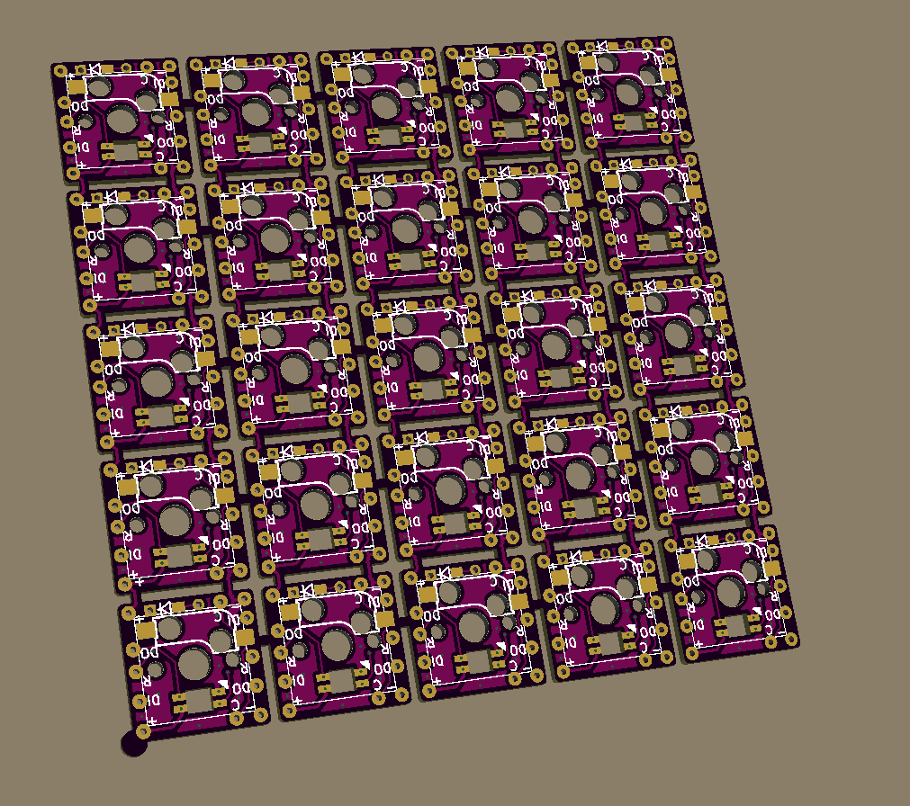

# Dactyl v4

Custom split ergonomic keyboard project based on a Dactyl Manuform-style shell, adapted around a flexible main PCB, a custom thumb cluster, and trackball support.

This repository contains the KiCad design files, printable case parts, and reference images used during the build.

## Overview

This project is my own Dactyl-style keyboard design. The main board is a custom flexible PCB, while the extra keys and thumb-cluster approach were informed by an existing open hardware reference.

Design references used for this build:

- Dactyl Manuform base shape and layout:
  `https://ryanis.cool/cosmos/beta#cm:Ct0CCigSDhDwbSA7QABIAGIDRjEwEgUQgG8gJxICIBMSAiAAEgA4HkCAwuADCicSDRDwYSA7QABIAGICRjkSBRCAYyAnEgIgExICIAASAxCwOzgKQAAKKhINEPBVIDtAAEgAYgJGOBIFEIBXICcSAiATEgIgABIDELAvOAlAgPC8AgokEg0Q8EkgO0AASABiAkY3EgUQgEsgJxICIBMSAiAAEgA4HUAACiQSDRDwPSA7QABIAGICRjYSBRCAPyAnEgIgExICIAASADgxQAAKPRIKEHAYRSA7QABIABIJEIABICdiAkYxEgIgExIMCIA4IABIgPoaWIMGEg8IgDBArYDMA0iA6iJY6wVQuQUKQxIIEHAgO0AASAASCRCAASAnYgJGMRIKCIAwIBNAHlioBBIMCIAoEKCACiAAWI4EEgoIgEAQMEAdWNoEQIDKkRRQ9gMYAEDohaCu8FVI2pyKMArEAQolEhkIgEAQQBjADED2ibjaBkian9SG0bATUPICMIAoOMAMQJaKAQodEhMQwIACIChA7Ye0xIAISICAtL8BOKgUQICA0AEKJhIZCIAgEEAYkBwgKEDeiYy1wFNI0IukptCxBzCAKDiQHEC/qJwBChoSEBBAIChA6IektcAHSICAhFw4+CNAgIDgDAodEhMQQCAAMMgBQJTOkuApSICAsKwBMBY4AEC1mAYYCiIJCAAQyAEYACAAQLGfoI2QBEiEj5TWoHgKwAIKJxINEPABIDtAAEgAYgJGMRIFEIADICcSAiATEgIgABIAOB1AgMLgAwokEg0Q8A0gO0AASABiAkYyEgUQgA8gJxICIBMSAiAAEgA4CUAACicSDRDwGSA7QABIAGICRjMSBRCAGyAnEgIgExICIAASADgKQIDwvAIKJBINEPAlIDtAAEgAYgJGNBIFEIAnICcSAiATEgIgABIAOB5AAAokEg0Q8DEgO0AASABiAkY1EgUQgDMgJxICIBMSAiAAEgA4MkAACiYSChBwGEYgO0AASAASChCAbSAnYgNGMTASAiATEgIgABIAOEZAAApEEggQcCA7QABIABIOEIBtGDEgJ0hBYgNGMTASCAiAMCATWKUEEgwIgDgQoIAKIABYvwQSCQiAQBAwGDtARTgxQIDKkRQYAUDnhaCu8FVI2pqKKAqOAQofEgcQQCAOQMMNEhIIgDggBUDn3gZIgIC43wNYlAI4FAorEhIQwIACGABAgqIHSICAkP0DUHISEwiAOBBAGABAgFZIgICg7ANQhQE4AAohEhIQQEDzpItISICAkP0DUFpYlQESCQiAICAPQIKcCzgTGAMiCgjIARDIARgAIABAto/MpvA1SJuPuN6gmhwiBSCEByguggECBAJYR2gA`
- Extra key and thumb-cluster inspiration:
  `https://github.com/swanmatch/MxLEDBitPCB/blob/master/readme_en.md`

## Gallery

### 3D keyboard visualization

### Main flexible PCB

### Extra keys / thumb cluster reference

## Repository Contents

- `dactyl_v4/3dForm/printfiles/` contains the printable case, plate, and holder STL files.
- `dactyl_v4/Kicad/flex/` contains the main KiCad project for the flexible PCB design.
- `pictures/` contains reference renders and PCB images used in this README.

## Hardware Summary

- Split ergonomic Dactyl-style keyboard
- Custom flexible main PCB
- Separate thumb / extra-key area inspired by MxLEDBitPCB
- Trackball support using a PMW3360 or PMW3389 sensor
- Dual RP2040 controller setup with TRRS interconnect

## Bill of Materials

Prices are intentionally left blank so they can be filled in later.

### Keys and switches

| Item | Qty | Notes | Unit Price | Total |
| --- | ---: | --- | ---: | ---: |
| XDA keycaps, 1u | 69 | Main alpha and modifier coverage |  |  |
| XDA keycaps, 1.25u | 1 | Single 1.25u key |  |  |
| XDA keycaps, 1.5u | 3 | Thumb / modifier keys |  |  |
| XDA keycaps, 2u | 7 | Larger thumb / special keys |  |  |
| MX-compatible switches | 80 | Switches for full build |  |  |
| 1N4148 diodes | 80 | One per switch position |  |  |

### Pointing device and mechanical parts

| Item | Qty | Notes | Unit Price | Total |
| --- | ---: | --- | ---: | ---: |
| 34 mm trackball | 1 | Main pointing device |  |  |
| PMW3360 or PMW3389 sensor | 1 | Trackball sensor |  |  |
| 3 x 6 x 2.5 mm bearings | 3 | Trackball support |  |  |
| 3 x 8 mm dowel pins | 3 | Trackball support alignment |  |  |
| Tindie-supported PCB for sensor assembly | 1 | Use a compatible board as required by the sensor setup |  |  |

### Electrical

| Item | Qty | Notes | Unit Price | Total |
| --- | ---: | --- | ---: | ---: |
| RP2040 Black Board USB-C | 2 | Aliexpress boards |  |  |
| PJ-320A TRRS connectors | 2 | One per half |  |  |
| TRRS cable | 1 | Interconnect cable between halves |  |  |
| Wire-wrap or magnet wire spool | 1 | Internal wiring |  |  |

### Mounting

| Item | Qty | Notes | Unit Price | Total |
| --- | ---: | --- | ---: | ---: |
| M3 x 6 mm flat head screws | 18 | Bottom plate and microcontroller holder |  |  |
| M3 x 8 mm flat head screws | 2 | Microcontroller holder through bottom plate |  |  |
| M3 screw inserts | 20 | Heat-set or press-fit, depending on print and process |  |  |

### Other parts

Add any remaining miscellaneous parts, consumables, or print-material costs here.

| Item | Qty | Notes | Unit Price | Total |
| --- | ---: | --- | ---: | ---: |
| TBD |  |  |  |  |

## Attribution

This repository is a custom project, but it explicitly builds on ideas and references from the following sources:

- Ryanis Cosmos for the Dactyl Manuform base geometry and layout exploration
- Swanmatch MxLEDBitPCB for ideas around extra keys and thumb-cluster implementation

The main board design in this repository is my own custom flexible PCB adaptation.

## License

This repository is distributed under the license included in [LICENSE](LICENSE).
